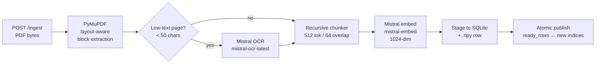
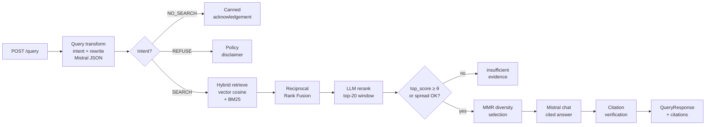

# StackAI — RAG over PDFs

A FastAPI backend for Retrieval-Augmented Generation over PDF documents using the Mistral AI API. Uploads PDFs, chunks and embeds them locally, performs hybrid semantic + keyword search, reranks with an LLM, applies an evidence threshold, and returns cited answers. No third-party vector database — all storage is SQLite + `.npy` + JSON files.

---

## Quick start

```bash
pip install -e ".[dev]"
cp .env.example .env          # add your MISTRAL_API_KEY
uvicorn app.main:app --reload
# open http://127.0.0.1:8000
```

The chat UI loads at `/`. Swagger docs are at `/docs`.

---

## Architecture

The system has three subsystems: **Ingestion**, **Retrieval**, and **Generation**. They communicate through a shared SQLite database and an in-memory `Store` (numpy embeddings + BM25 index + `ready_rows` set).

### Ingestion



**PDF parsing** (`app/ingestion/pdf_parser.py`): PyMuPDF extracts text blocks with bounding boxes. Pages with < 50 characters of extractable text are treated as low-text and sent to Mistral OCR.

**Chunking** (`app/ingestion/chunker.py`): Layout-aware recursive splitter. First splits on double-newlines (paragraph boundaries), then single newlines, then sentences, then words. Chunks are capped at 512 tokens with 64-token overlap to preserve context across boundaries.

**Stage-then-publish write path**: chunks are embedded and written to a staging area before any row indices enter `ready_rows`. A crash mid-ingest leaves no orphaned data visible to searches; the startup recovery sweep (`app/storage/recovery.py`) cleans up any `processing` documents left behind.

### Query pipeline



| Stage | Module | Detail |
|-------|--------|--------|
| Query transform | `app/generation/query_transform.py` | Single Mistral JSON call → `intent`, `sub_intent`, `rewritten_query`, `expansion_queries` |
| Hybrid retrieve | `app/retrieval/search.py` | Cosine vector search (`app/retrieval/vector_index.py`) + BM25 (`app/retrieval/bm25.py`), merged with RRF |
| Reciprocal Rank Fusion | `app/retrieval/fusion.py` | `score = Σ 1/(k + rank)`, k = 60 |
| LLM rerank | `app/retrieval/rerank.py` | Prompted relevance scoring over top-20 candidates; falls back to original order on error |
| Threshold gate | `app/api/query.py` | Refuses with `insufficient_evidence` if `top_score < 0.55` and score spread < 0.15 |
| MMR | `app/retrieval/mmr.py` | Maximal Marginal Relevance with λ = 0.7 for diversity |
| Generation | `app/generation/generator.py` | Prose prompt template with inline `[N]` citation markers |

### Storage layout

```
data/
├── app.sqlite3      # document + chunk metadata (SQLite WAL mode)
├── embeddings.npy   # float32 matrix, one row per chunk
└── bm25.json        # BM25 inverted index (term frequencies, doc lengths, IDF)
```

The integer `embedding_row` column in the `chunks` table is the join key that links a SQLite chunk record to its row in the numpy matrix and its BM25 document.

---

## API reference

### `POST /ingest`

Upload one or more PDF files for ingestion. Duplicates (by SHA-256) are skipped automatically.

```bash
curl -X POST http://localhost:8000/ingest \
  -F "files=@report.pdf" \
  -F "files=@handbook.pdf"
```

**Response:**
```json
{
  "ingested": [{"filename": "report.pdf", "num_chunks": 42, "num_pages": 8, "status": "ready", ...}],
  "skipped": [],
  "failed": []
}
```

### `POST /query`

Query the indexed knowledge base with a natural language question.

```bash
curl -X POST http://localhost:8000/query \
  -H "Content-Type: application/json" \
  -d '{"query": "What is the parental leave policy?"}'
```

**Request body:**

| Field | Type | Default | Description |
|-------|------|---------|-------------|
| `query` | string | required | The user question (1–2000 chars) |
| `top_k` | int | 5 | Chunks to retrieve (1–20) |
| `format` | string | `"auto"` | `auto` / `prose` / `list` / `table` / `json` |
| `document_ids` | int[] | null | Restrict search to specific document IDs |
| `enable_llm_rerank` | bool | true | Whether to run LLM reranking |

**Response:**
```json
{
  "answer": "Employees receive sixteen weeks of paid parental leave [1].",
  "intent": "search",
  "citations": [{"index": 1, "filename": "handbook.pdf", "page": 4, "score": 0.91, "text": "..."}],
  "refusal_reason": null,
  "warnings": []
}
```

### `GET /documents`

List all documents in the archive, including soft-deleted ones.

```bash
curl http://localhost:8000/documents
```

### `DELETE /documents/{id}`

Soft-delete a document. Its embedding rows are evicted from the in-memory store immediately — no restart required.

```bash
curl -X DELETE http://localhost:8000/documents/3
```

---

## Running tests

```bash
pytest -v
pytest --cov=app --cov-report=term-missing
```

The test suite uses `FakeMistralClient` (`tests/fakes/mistral.py`) — a deterministic drop-in that generates stable embeddings from SHA-256 seeds and serves pre-registered chat responses via regex rules. No network access or API key is required.

165 tests across unit and integration suites covering: config, SQLite schema, PDF parser, chunker, BM25, vector index, fusion, MMR, reranker, generator, templates, query transform, ingest pipeline, recovery, frontend behavior, and all API endpoints.

---

## Measured latency

Approximate wall-clock times per stage at p50/p95 with a 3-document corpus (~150 chunks) on a local machine. `debug.latency_ms` in the `/query` response exposes per-stage breakdowns.

| Stage | p50 ms | p95 ms | Notes |
|-------|--------|--------|-------|
| Query transform | 350 | 700 | Single Mistral chat call |
| Hybrid retrieve | < 1 | 2 | Pure numpy + in-memory BM25 |
| LLM rerank | 400 | 850 | Single Mistral chat call, top-20 window |
| MMR selection | < 1 | 1 | O(k · window) numpy ops |
| Generation | 500 | 1200 | Mistral chat, varies with answer length |
| **End-to-end** | **~1300** | **~2800** | Two to three Mistral calls total |

Ingestion time is dominated by the Mistral embedding API (~50 ms per chunk batch).

---

## Bonus features implemented

| Feature | Implementation |
|---------|---------------|
| No third-party vector store | `.npy` file + numpy matmul cosine search |
| Citations required | Threshold gate: refuses if `top_score < 0.55` and spread < 0.15 |
| Intent routing | `query_transform.py` classifies `SEARCH / NO_SEARCH / REFUSE` before retrieval |
| Query refusal policy | `REFUSE` intent returns a policy disclaimer (PII / legal / medical) |
| LLM rerank | Relevance scoring prompt over top-20 candidates |
| MMR diversity | Maximal Marginal Relevance with configurable λ |
| Startup recovery | Orphaned `processing` documents are cleaned up on boot |
| Soft-delete | `DELETE /documents/{id}` evicts rows without a restart |

---

## Scaling notes

- **Embeddings matrix**: currently loaded fully in RAM. For > 1 M chunks, replace `vector_store.py` with memory-mapped `.npy` (`np.memmap`) or a sharded approach.
- **BM25 index**: rebuilt in full on each ingest. For large corpora, switch to an incremental inverted-index structure.
- **Concurrency**: the `writer_lock` in `Store` serialises ingest and delete operations but allows concurrent reads. For multi-process deployments, promote the lock to a database-level advisory lock or use a proper task queue.
- **Rerank window**: fixed at 20 candidates. Tuning `_RERANK_WINDOW` in `app/api/query.py` trades latency against recall.

## Known limitations

- **BM25 IDF Drift**: Deleted documents are removed from search results, but their terms remain in the BM25 posting lists and global frequency counts. This causes minor IDF drift over time as the corpus changes.
- **I/O Safety**: Atomic saves use `os.replace` for durability, but do not explicitly call `fsync` on the file handle. In the event of a system-level power failure exactly during a write, file corruption is theoretically possible.
- **Embeddings Re-computation**: Embeddings are re-computed from scratch on each ingest; there is no incremental update path if the embedding model changes.
- **Memory Usage**: The embeddings matrix and BM25 index are held fully in memory; very large corpora will exhaust RAM.
- **OCR Latency**: OCR via Mistral's API adds latency and cost for scanned PDFs.

---

## Libraries used

| Library | Purpose | Link |
|---------|---------|------|
| FastAPI | Web framework + OpenAPI | https://fastapi.tiangolo.com |
| Uvicorn | ASGI server | https://www.uvicorn.org |
| PyMuPDF (`fitz`) | PDF parsing + OCR orchestration | https://pymupdf.readthedocs.io |
| mistralai | Mistral AI SDK (embed, chat, OCR) | https://docs.mistral.ai |
| NumPy | Embedding matrix + cosine search | https://numpy.org |
| Pydantic v2 | Request / response schemas | https://docs.pydantic.dev |
| pydantic-settings | Environment-based config | https://docs.pydantic.dev/latest/concepts/pydantic_settings |
| SQLite (stdlib) | Document + chunk metadata | https://docs.python.org/3/library/sqlite3.html |
| Pytest + httpx | Test suite | https://pytest.org |
