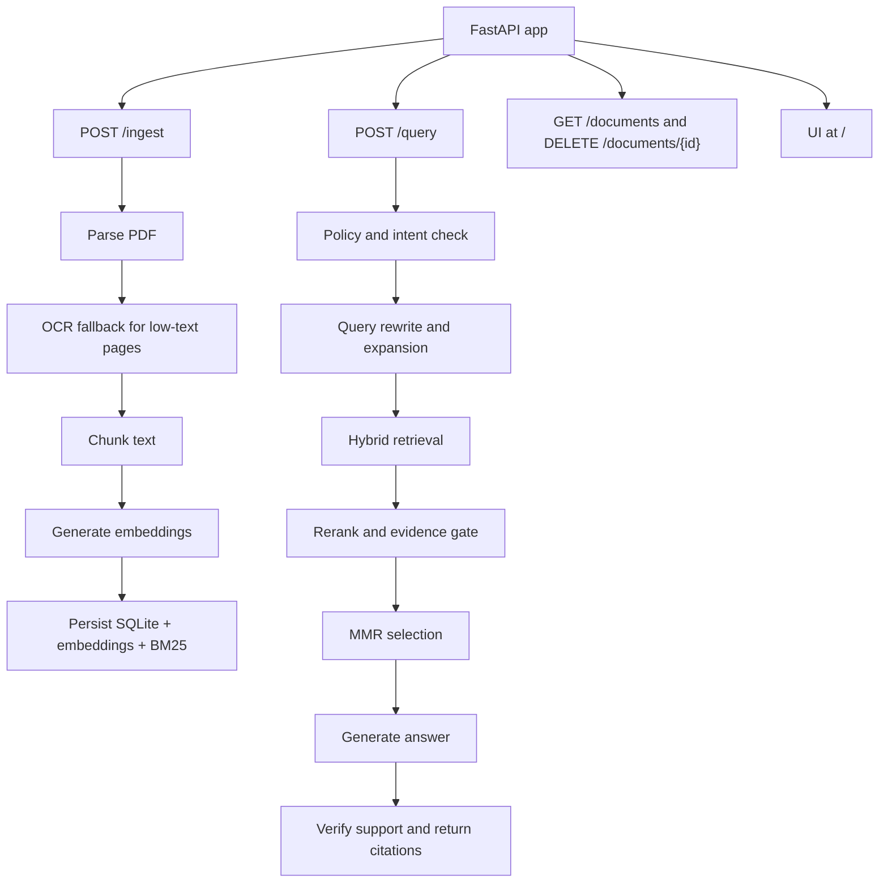

# App Overview

This folder contains the FastAPI application package for StackAI. The app has three main flows: PDF ingestion, retrieval over indexed content, and answer generation with citations.

## Structure

```text
app/                        # main application package
|-- main.py                 # creates the FastAPI app and mounts the UI
|-- config.py               # environment-based settings and file paths
|-- deps.py                 # shared in-memory store and dependency helpers
|-- mistral_client.py       # wrapper/protocol for Mistral API usage
|-- api/                    # HTTP layer exposed to clients
|   |-- ingest.py           # upload endpoint for PDF ingestion
|   |-- query.py            # query endpoint for the RAG pipeline
|   |-- documents.py        # list and delete document endpoints
|   `-- schemas.py          # request and response models
|-- ingestion/              # turns PDF files into indexed chunks
|   |-- pdf_parser.py       # extracts page blocks from PDFs
|   |-- ocr_fallback.py     # applies OCR to low-text pages
|   |-- chunker.py          # groups and splits text into chunks
|   `-- pipeline.py         # orchestrates ingest, staging, and publish
|-- retrieval/              # finds and ranks relevant chunks
|   |-- search.py           # hybrid retrieval entrypoint
|   |-- rerank.py           # LLM reranking of retrieved chunks
|   |-- hyde.py             # fallback retrieval using hypothetical answers
|   `-- mmr.py              # diversifies the final selected context
|-- generation/             # converts retrieved chunks into an answer
|   |-- query_transform.py  # intent detection and query rewriting
|   |-- generator.py        # final answer generation
|   `-- verifier.py         # checks answer support against sources
|-- storage/                # persistence and startup reconciliation
|   |-- db.py               # SQLite connection and schema bootstrap
|   |-- repository.py       # database read/write helpers
|   `-- recovery.py         # restores consistent state on startup
`-- static/                 # browser chat UI assets
```

`main.py` wires the app together. `api/` is the HTTP layer, `ingestion/` builds searchable content from PDFs, `retrieval/` finds relevant chunks, `generation/` turns those chunks into answers, `storage/` manages persisted state, and `static/` serves the chat UI.

## High-level flow



## Ingestion pipeline

1. `api/ingest.py` accepts one or more PDF uploads and validates the files.
2. `ingestion/pdf_parser.py` extracts page content and layout blocks with PyMuPDF.
3. `ingestion/ocr_fallback.py` sends low-text pages through OCR when needed.
4. `ingestion/chunker.py` groups content into sections and splits it into chunk-sized windows.
5. `retrieval/embeddings.py` generates embeddings for the chunk text.
6. `ingestion/pipeline.py` writes document metadata to SQLite, stages the embeddings and BM25 index, then publishes the updated search state.

## Query pipeline

1. `api/query.py` applies policy checks and classifies whether a search is needed.
2. `generation/query_transform.py` rewrites the query for retrieval and can expand it.
3. `retrieval/search.py` runs hybrid retrieval using vector search and BM25, then merges rankings with reciprocal rank fusion.
4. `retrieval/rerank.py` reranks the top candidates, and `retrieval/hyde.py` can retry weak searches with a hypothetical document embedding.
5. `api/query.py` applies the evidence gate and uses `retrieval/mmr.py` to keep the final context diverse.
6. `generation/generator.py` produces the final answer and `generation/verifier.py` checks whether the answer is supported by the selected chunks.

## Storage and runtime

- SQLite stores document and chunk metadata.
- `storage/vector_store.py` persists the embedding matrix to `data/embeddings.npy`.
- `storage/bm25_store.py` persists the keyword index to `data/bm25.json`.
- `deps.py` keeps the in-memory store used by the request path.
- `storage/recovery.py` reconciles SQLite and the persisted search files on startup so only fully published documents are searchable.
